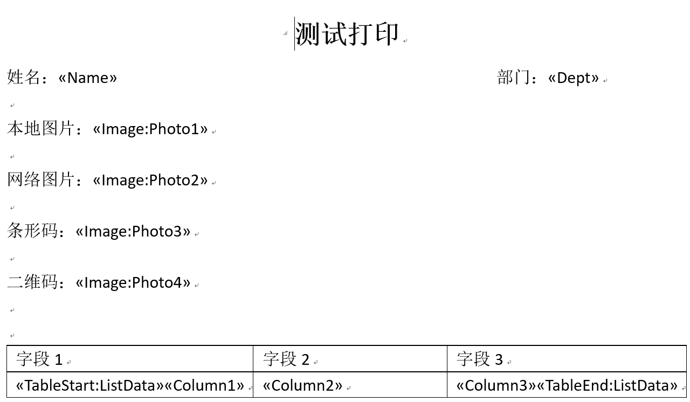
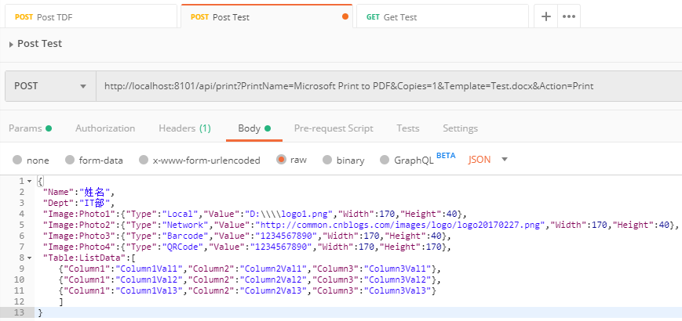

# 安装
以管理员方式运行CMD

进入ZEQP.Print.Service.exe所在目录

然后运行

```CMD
ZEQP.Print.Service.exe install
```

# 启动
以管理员方式运行CMD

进入ZEQP.Print.Service.exe所在目录

然后运行

```CMD
ZEQP.Print.Service.exe start
```

也可以到服务管理面板，找到ZEQPPrintService服务

右键选择“启动”

# 模板编辑
使用Word编辑要打印的模板，使用“域”作为占位符




# 打印
## GET请求打印


## POST请求打印


# 停止
以管理员方式运行CMD

进入ZEQP.Print.Service.exe所在目录

然后运行

```CMD
ZEQP.Print.Service.exe stop
```

也可以到服务管理面板，找到ZEQPPrintService服务

右键选择“停止”

# 卸载
以管理员方式运行CMD

进入ZEQP.Print.Service.exe所在目录

然后运行

```CMD
ZEQP.Print.Service.exe uninstall
```


如果在启动的时候报HttpListener错误

以管理员方式运行CMD，输入以下命令

```CMD
netsh http add urlacl url=http://+:8101/api/print/ sddl="D:(A;;GX;;;WD)" user=\Everyone
```

注意：+为配置的Host  8101为配置的Port